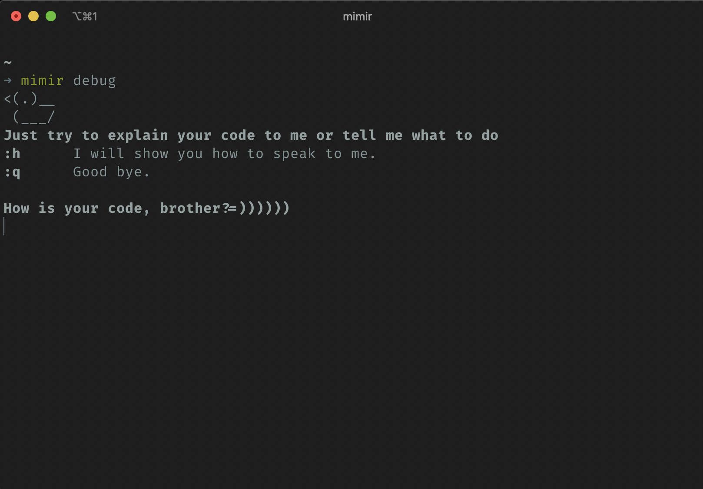

# Mimir

> I know every corner of these lands, every language spoken, every war waged, every deal ever struck. They call me… Mimir! —smartest man alive, and I have the answer to your every question.
> 
> -–Mimir, introducing himself to Kratos, *God of War* (2018)

An advisor for your development process.

## Usage

### Advisor Mimir  


### Ruber duck debugging (or Mimir debugging)  


## Install

### macOS
```
$ brew tap mkhoi1998/mimir
$ brew install mimir
```
### ubuntu/ debian
Download the binary package for ubuntu
```
$ wget https://github.com/mkhoi1998/mimir/releases/download/v1.0.0/mimir-linux-amd64-1.0.0.tar.gz
```
Extract and install the binary package
```
$ tar xf mimir-linux-amd64-1.0.0.tar.gz
$ sudo cp mimir /usr/local/bin
```